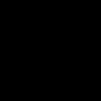

# Diffusion-Limited Aggregation animation generator
This is a fun little program for generating animations of [diffusion-limited aggregation](https://en.wikipedia.org/wiki/Diffusion-limited_aggregation). The performance may not be the best, but it's manageable.

## Examples
_If your browser doesn't support animated PNGs, you can download these examples as videos from the `examples` folder._




## Usage
```
dla-anim [options] <output.png>
  -g, --grid-size <gridSize> - default 128
  --target-fill <targetFill> - the target area ratio to fill, default 0.2

  --start-json <startJson> - set the coordinates of the starting point(s),
        for example [[1,1],[64,64]]
  --start-png <startPng> - set the starting points from the specified image
```

## Building
```sh
haxelib newrepo
haxelib --always --skip-dependencies install haxelib-lock.hxml
haxe build.hxml
```
The binary will be located at `build/Main`.
